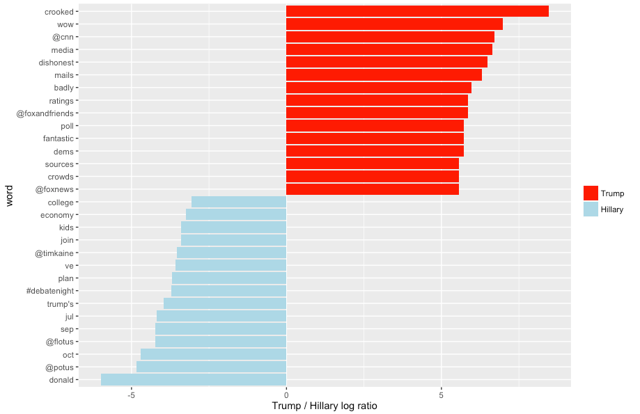
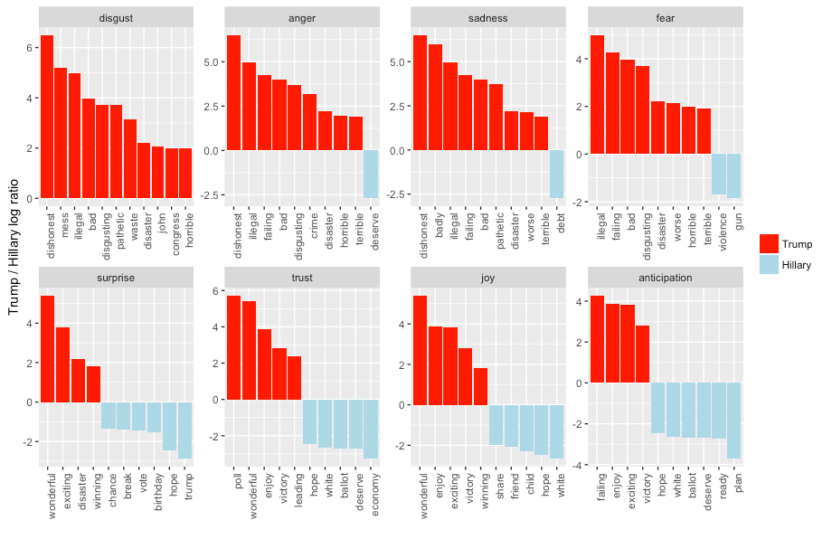

# Sentiment Analysis of Political Candidates' Tweets

Disclaimer: This study does not in any way represent my political views. My intent is to look at the data through an objective lens, nothing more. 

Note: I borrow heavily from David Robinson's methodology, making use of his tidy text package. See inspiration here: http://varianceexplained.org/r/trump-tweets/

